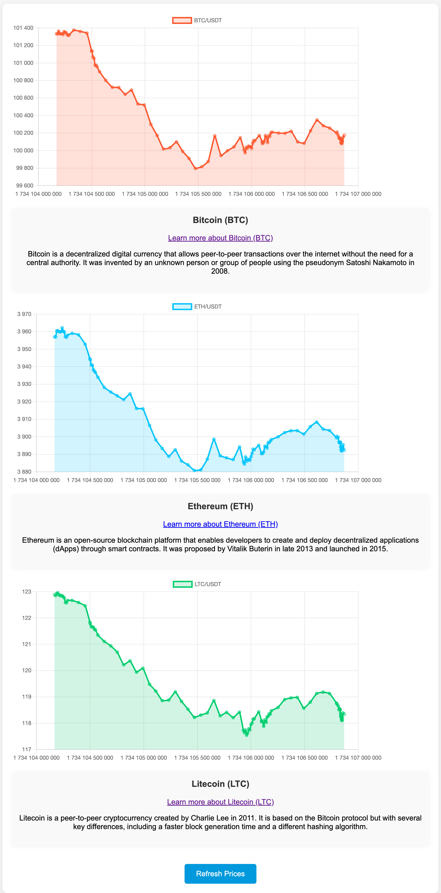

# Crypto Price Tracker

This project tracks the current prices of popular cryptocurrencies (BTC, ETH, and LTC) from the Binance exchange using the Binance API. It retrieves cryptocurrency prices and displays them on a web page, updating every 10 seconds. Prices are also saved in a database.

## Features

- Displays current prices for Bitcoin (BTC), Ethereum (ETH), and Litecoin (LTC).
- Updates prices every 10 seconds via API requests to Binance.
- Saves the retrieved prices in a database using Django's ORM.

## Installation

1. Clone the repository:
    ```bash
    git clone https://github.com/yourusername/crypto-price-tracker.git
    cd crypto-price-tracker
    ```

2. Create and activate a virtual environment:
    ```bash
    python -m venv .venv
    source .venv/bin/activate  # For Linux/MacOS
    .venv\Scripts\activate  # For Windows
    ```

3. Install the required dependencies:
    ```bash
    pip install -r requirements.txt
    ```

4. Set up the database:
    ```bash
    python manage.py migrate
    ```

5. Run the development server:
    ```bash
    python manage.py runserver
    ```

6. Open your browser and go to `http://127.0.0.1:8000/` to see the prices of BTC, ETH, and LTC.

## File Structure

- `crypto/link.yaml`: Contains the API URLs for the Binance cryptocurrency prices.
- `crypto/models.py`: Defines the model for storing cryptocurrency data.
- `crypto/views.py`: Handles the logic for fetching and displaying cryptocurrency prices.
- `crypto/templates/index.html`: The frontend HTML file displaying the cryptocurrency prices.

## Links

- [Binance API Documentation](https://www.binance.com/en/binance-api/)
- [Django Documentation](https://docs.djangoproject.com/en/stable/)

## Contributions

Feel free to open issues or create pull requests to contribute to this project!


# Трекер цен криптовалют

Этот проект отслеживает текущие цены популярных криптовалют (BTC, ETH, LTC) с биржи Binance с использованием Binance API. Цены на криптовалюты извлекаются и отображаются на веб-странице, обновляясь каждые 10 секунд. Полученные цены также сохраняются в базе данных.

## Особенности

- Отображение текущих цен на Bitcoin (BTC), Ethereum (ETH) и Litecoin (LTC).
- Обновление цен каждые 10 секунд с помощью API-запросов к Binance.
- Сохранение полученных цен в базу данных с использованием Django ORM.

## Установка

1. Клонируйте репозиторий:
    ```bash
    git clone https://github.com/yourusername/crypto-price-tracker.git
    cd crypto-price-tracker
    ```

2. Создайте и активируйте виртуальное окружение:
    ```bash
    python -m venv .venv
    source .venv/bin/activate  # Для Linux/MacOS
    .venv\Scripts\activate  # Для Windows
    ```

3. Установите необходимые зависимости:
    ```bash
    pip install -r requirements.txt
    ```

4. Настройте базу данных:
    ```bash
    python manage.py migrate
    ```

5. Запустите сервер разработки:
    ```bash
    python manage.py runserver
    ```

6. Откройте браузер и перейдите по адресу `http://127.0.0.1:8000/` для просмотра цен на BTC, ETH и LTC.

## Структура файлов

- `crypto/link.yaml`: Содержит URL API для цен криптовалют с Binance.
- `crypto/models.py`: Определяет модель для хранения данных о криптовалютах.
- `crypto/views.py`: Обрабатывает логику получения и отображения цен на криптовалюты.
- `crypto/templates/index.html`: Шаблон HTML для отображения цен на криптовалюты.

## Полезные ссылки

- [Документация Binance API](https://www.binance.com/en/binance-api/)
- [Документация Django](https://docs.djangoproject.com/en/stable/)

## Вклад

Не стесняйтесь открывать issues или создавать pull requests, чтобы внести свой вклад в проект!


